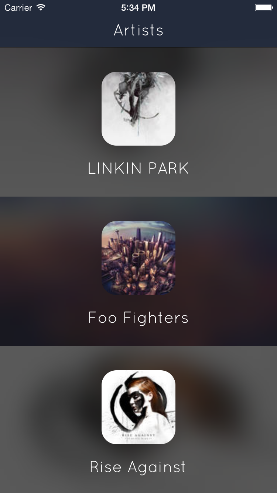
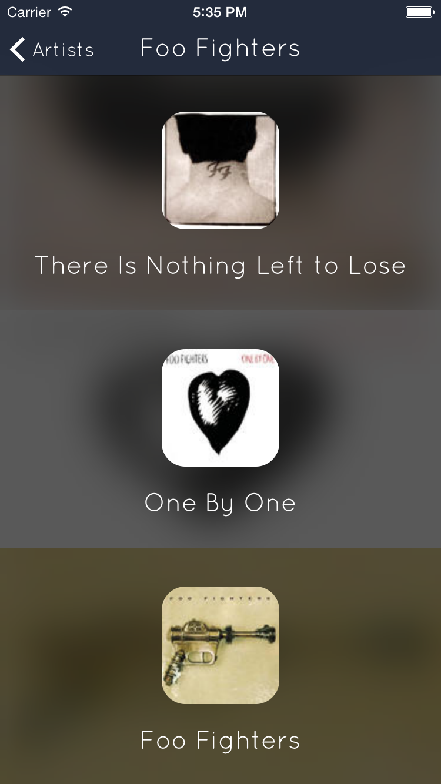

Artistic
=========

 **Artistic** is a sample application to show how to create a Web Service and its corresponding model layer using [Mantle](https://github.com/github/Mantle) and the [Overcoat](https://github.com/gonzalezreal/Overcoat) (AFNetworking extension) to persist on Core Data.  
Artistic allows you to see the albums of some default Artists through iTunes Store API.

## Full description coming soon

## Contact
[Antonio J. Martinez](http://github.com/AntonioJMartinez)  
[@AntonioJMS](https://twitter.com/antoniojms)

## License
Artistc is available under the MIT license. See [LICENSE.md](https://github.com/AntonioJMartinez/Artistic/master/LICENSE.md).